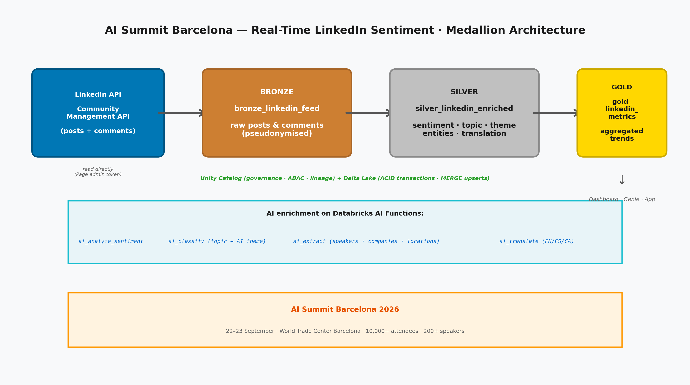
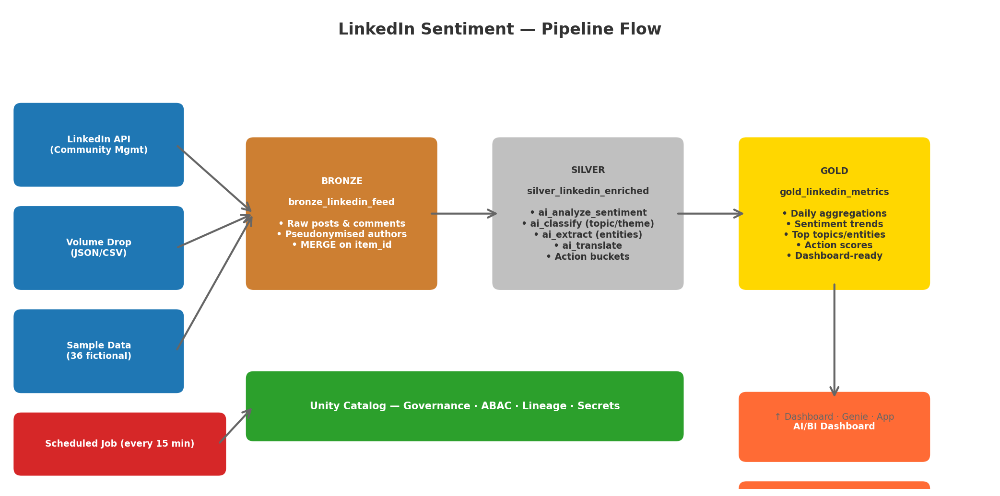
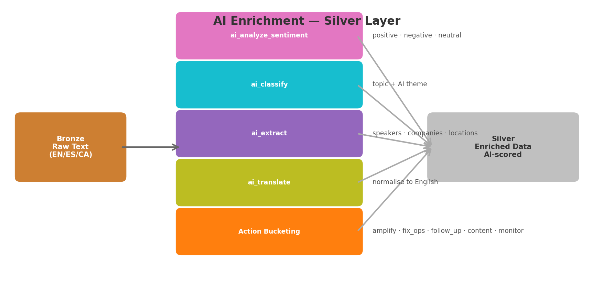
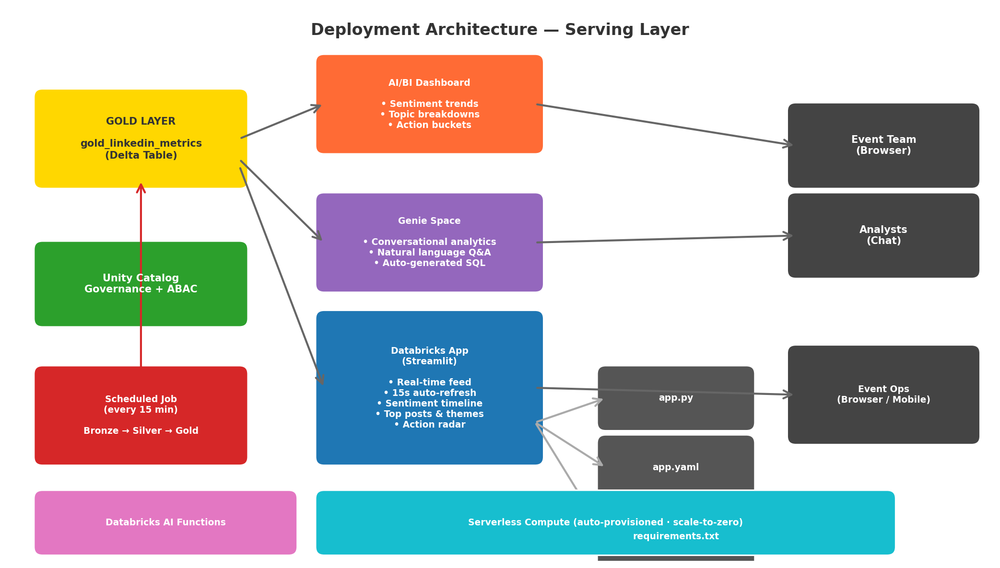
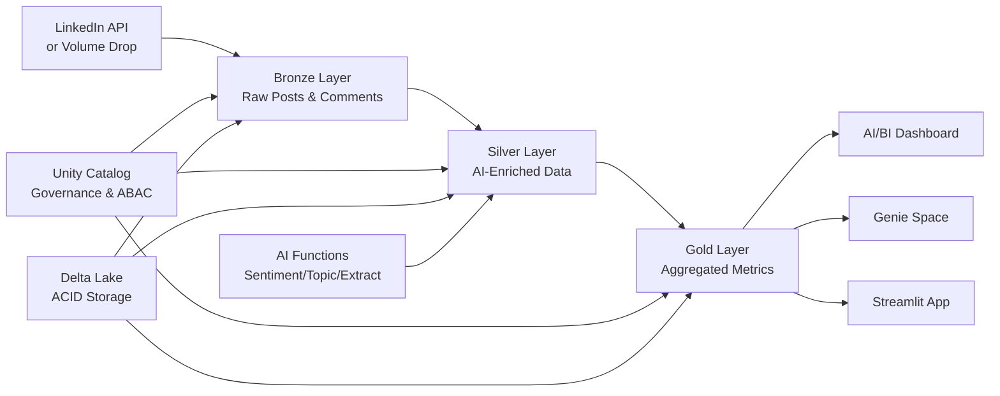

# 📊 AI Summit Barcelona 2026 — Real-Time LinkedIn Sentiment on Databricks

**Build a complete social-sentiment lakehouse from raw LinkedIn data to production analytics** — completely free! This tutorial uses the AI Summit Barcelona 2026 conversation on LinkedIn as an example, but the skills you learn apply to any social listening, event monitoring, or brand analytics project. Perfect for developers looking to break into data & AI.

-blue)


## 🎯 Why This Tutorial?

**There's huge demand for data and AI skills, but practical 'learn by doing' content is missing.** Whether you're prepping for interviews, building your portfolio, or just want hands-on experience with the modern data stack, this tutorial gives you a solid foundation.

**This isn't just about social data** — we use LinkedIn posts and comments from AI Summit Barcelona 2026 as a relatable example because everyone understands event feedback. The architecture, patterns, and skills you'll learn apply to any data engineering project: financial data, IoT sensors, customer analytics, or real-time streams.

**You'll build something portfolio-worthy** that demonstrates real-world data engineering expertise employers want to see. By the end, you'll have hands-on experience with the same technologies used at companies like Netflix, Uber, and Databricks.

## 📋 What You'll Master

**Core Data Engineering Skills:**
- Medallion Architecture (industry-standard Bronze → Silver → Gold pattern)
- Data lakehouse principles used in production at scale
- Unity Catalog for enterprise data governance and ABAC policies
- Apache Spark for distributed data processing
- Delta Lake for reliable, ACID-compliant storage

**AI & Enrichment Skills:**
- Databricks AI functions (`ai_analyze_sentiment`, `ai_classify`, `ai_extract`, `ai_translate`)
- Real-time sentiment analysis and topic classification
- Named entity extraction (speakers, companies, locations)
- Multi-language support (English, Spanish, Catalan)

**Technical Skills That Get You Hired:**
- REST API integration (LinkedIn Community Management API)
- SQL optimization and Delta Lake performance tuning
- Python data processing and visualization
- Production-ready pipeline development with scheduled jobs
- Data quality monitoring and validation

**Business Intelligence & Analytics:**
- Building analytics-ready datasets from raw social data
- Implementing business logic and action-bucket scoring
- Creating AI/BI dashboards and Genie spaces
- Deploying a real-time Streamlit app with auto-refresh

**By the end of this tutorial, you'll understand:**
- How to design and implement a complete social-listening pipeline from scratch
- Why the medallion architecture is the gold standard for data lakehouses
- How to enrich raw data with AI at scale
- What makes data "production-ready" vs just working
- How to serve analytics through dashboards, Genie, and apps

## 🚀 Prerequisites

**No prior data engineering experience required!** This tutorial is designed for developers who want to learn data & AI fundamentals.

### 1. **Free Databricks Account**
- Sign up at [databricks.com/learn/free-edition](https://bit.ly/dbx-free-signup)
- No credit card required, free forever
- Includes Apache Spark, Delta Lake, Unity Catalog, and AI functions
- Serverless compute included

### 2. **LinkedIn Data (Optional)**
- **Sample data included** — 36 fictional posts and comments (EN/ES/CA) so every module works end to end
- **Optional: LinkedIn API** — if you have a LinkedIn Page with the Community Management API approved, bring your own access token
- **Optional: Volume drop** — export from a licensed social-listening tool and drop JSON/CSV files into the Unity Catalog volume

### 3. **Basic Knowledge (Helpful)**
- SQL fundamentals (we explain advanced concepts)
- Python basics (tutorial is step-by-step)
- Understanding of tables and databases

## 📁 Repository Contents

```
├── 00_Setup.py                    # Unity Catalog setup, config, shared helpers
├── 01_LinkedIn_Token.py           # Store LinkedIn token, seed sample data, test AI functions
├── 02_Pipeline.py                 # Medallion pipeline: Bronze/Silver/Gold + job scheduling
├── 03_Preview_Tables.py            # Preview Bronze, Silver, Gold tables
├── 04_Dashboard_and_Genie.py      # Generate AI/BI dashboard + Genie space
├── 05_App.py                       # Deploy the single-page Streamlit app
├── README_START_HERE.py            # In-notebook quick-start guide
├── app/                            # Streamlit app source
│   ├── app.py                      # App logic
│   ├── app.yaml                    # Databricks App config
│   ├── requirements.txt            # Python dependencies
│   ├── run.py                      # Entry point
│   └── summit_logo.png             # Event logo
├── img/                            # Architecture diagrams and images
│   ├── medallion_architecture.png  # Medallion architecture diagram
│   └── summit_logo.png             # Event logo
├── solution/                       # Complete reference solution with actual code
│   ├── 00_Setup.py
│   ├── 01_LinkedIn_Token.py
│   ├── 03_Preview_Tables.py
│   ├── 04_Dashboard_and_Genie.py
│   ├── 05_app/                     # Streamlit app (working reference)
│   └── img/
└── README.md                      # This guide
```

## 🛠️ Quick Start

**Get up and running in 15 minutes:**

1. **Setup Databricks**
   - [Sign up for free account](https://bit.ly/dbx-free-signup)
   - Create new workspace

2. **Import the Notebooks**
   - Clone this repository or download the `.py` files
   - Go to the left sidebar → *Workspace* → *your user folder*
   - Click the *folder icon* and choose *"Import"*
   - Import each `.py` file as a Databricks notebook (source format: Python)

3. **Run the Setup**
   - Open `00_Setup` and run all cells
   - This creates the Unity Catalog schema, volume, and shared helpers

4. **Seed Sample Data & Test AI**
   - Open `01_LinkedIn_Token` and run all cells
   - The sample dataset (36 fictional posts/comments) is seeded automatically
   - AI functions are tested on real LinkedIn-style text

5. **Build the Pipeline**
   - Open `02_Pipeline` and run all cells
   - Bronze → Silver → Gold tables are created in Unity Catalog

6. **Visualize & Deploy**
   - Run `04_Dashboard_and_Genie` to generate the AI/BI dashboard and Genie space
   - Run `05_App` to deploy the Streamlit app with 15-second auto-refresh

<div align="center">
  
</div>

### 🔄 Pipeline Flow

<div align="center">
  
</div>

### 🤖 AI Enrichment

<div align="center">
  
</div>

## 📚 Learning Journey

### **Foundation: Understanding the Business Context**

AI Summit Barcelona 2026 (22–23 September, World Trade Center Barcelona) is the centrepiece of Barcelona AI Week: 10,000+ attendees, ~200 speakers, a 500-builder hackathon, and ~50 side events. The professional conversation about the summit lives on LinkedIn — speakers post their decks, attendees post recaps, sponsors post booth photos. This demo reads that conversation to decide what to amplify, what to fix, and who to follow up with.

### 🏗️ Lakehouse Architecture Overview

**Medallion Architecture (Industry Standard):**
- **Bronze Layer** → Raw LinkedIn posts and comments ingested via API or volume drop
- **Silver Layer** → AI-enriched, cleaned, validated, business-ready data
- **Gold Layer** → Aggregated metrics, action buckets, and dashboard-ready summaries

<div align="center">
  
</div>

**Technology Stack:**
- **Unity Catalog** → Data governance, ABAC policies, and pseudonymisation
- **Delta Lake** → Reliable storage with ACID transactions and MERGE upserts
- **Apache Spark** → Distributed processing engine
- **Databricks AI Functions** → Sentiment, topic, entity extraction, translation
- **AI/BI Dashboards & Genie** → Conversational analytics and visualisations
- **Databricks Apps** → Streamlit app with real-time auto-refresh

### **Bronze Layer: Raw Data Ingestion**
- Unity Catalog volume creation and management
- LinkedIn Community Management API integration (posts + comments)
- Member author pseudonymisation (SHA-256) for GDPR compliance
- Delta table creation with MERGE on `item_id` for idempotent ingestion
- Immutable raw storage with full audit trail

### **Silver Layer: AI Enrichment & Data Quality**
- `ai_analyze_sentiment` — positive, negative, neutral classification
- `ai_classify` — topic and AI theme categorisation
- `ai_extract` — named entities (speakers, companies, locations)
- `ai_translate` — multi-language normalisation (EN/ES/CA)
- Action bucketing: amplify, fix_ops, follow_up, content, monitor
- Data quality validation and schema evolution

### **Gold Layer: Analytics & Business Intelligence**
- Daily aggregations and summary statistics
- Sentiment trends over time
- Top topics, themes, and entities
- Action bucket scoring for event operations
- Dashboard-ready datasets for AI/BI and Genie

### **Production Deployment**

<div align="center">
  
</div>

- Scheduled pipeline job (every 15 minutes)
- AI/BI dashboard with real-time sentiment tracking
- Genie space for conversational analytics
- Streamlit app with 15-second auto-refresh
- Monitoring and alerting best practices



## 💡 Why This Approach Works

**Real-world applicable:** The patterns you learn here scale from event monitoring to enterprise brand analytics handling millions of social posts. Companies like Netflix, Databricks, and Uber use these exact architectural patterns.

**Portfolio-ready:** You'll have a complete end-to-end project demonstrating modern data engineering, AI enrichment, and production deployment skills that hiring managers want to see. The project shows you can handle the full data lifecycle from ingestion to analytics to app deployment.

**Foundation for AI:** This tutorial builds the data foundation needed for machine learning and AI projects. Clean, well-structured, AI-enriched data in your Gold layer is exactly what ML models and conversational AI need.

**GDPR-aware:** Member authors are pseudonymised in Bronze, and ABAC policies can mask free text — important when processing content tied to identifiable professionals in the EU.

## 🔧 Customising for Your Event

In `00_Setup`, change these variables to your own event and LinkedIn Page:

| Variable | What it controls |
|---|---|
| `EVENT_NAME` | Event name used in dashboards and app |
| Dates | `LOOKBACK_FROM` / `LOOKBACK_TO` for the analysis window |
| `TRACK_KEYWORDS` | Keywords to filter relevant posts |
| `LI_ORG_URN` | Your LinkedIn Page's `urn:li:organization:<id>` |

Everything downstream — pipeline, enrichment, dashboard, Genie, and app — follows automatically.

## 🌟 What's Next?

After mastering this tutorial, you'll have the foundation to tackle any social listening or event analytics challenge. The skills transfer directly to processing customer feedback, brand mentions, product reviews, or real-time streaming data. Consider extending your project with:
- Custom ML models for domain-specific sentiment
- Real-time streaming with Kafka or Auto Loader
- Multi-platform ingestion (X, Reddit, Discord)
- Alerting and notification pipelines

## 🤝 Contributing

Found ways to improve the tutorial? Fork the repository, create a feature branch, and submit a pull request. Contributions help make this resource better for everyone learning data engineering.

## 🔗 Connect & Learn More

Let's stay in touch and keep learning together!

[](https://www.linkedin.com/in/arikdutta)
[](https://github.com/arikdutta)

⭐ **Found this helpful?** Star the repo and share with developers interested in data & AI!

**Tags**: `data-engineering` `databricks` `apache-spark` `delta-lake` `unity-catalog` `medallion-architecture` `lakehouse` `ai-functions` `social-listening` `linkedin-api` `sentiment-analysis` `tutorial` `beginner-friendly`